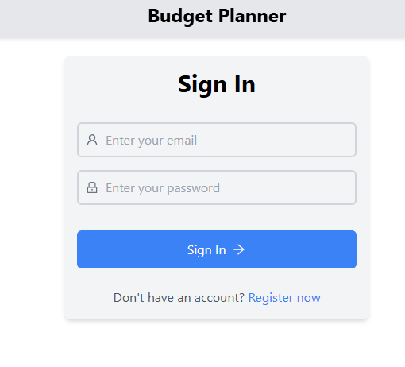

# Budget Planner

Budget Planner Web App using React

## Overview
This web application serves as a budget planner, allowing users to manage their finances effectively. It provides functionalities for adding budgets, managing budgets, adding transactions, and managing transactions.

## Features
### Authentication
- **Login:** Secure login functionality for registered users.
- **Register:** New users can create accounts to access the app.
- **Sign Out:** Allows users to securely log out of their accounts.

### Dashboard
- **Transaction Summary:** Provides an overview of transactions, categorized by type (expense or income).
- **Budget Summary:** Displays a summary of budgets, showing allocated amounts and expenditures.

### Menu Navigation
- **Left-Side Menu:** Accessible navigation menu offering seamless access to major functionalities.

### Manage Budgets
- **Add Budget:** Allows users to add new budget categories with allocated amounts.
- **Update and Delete:** Enables users to modify existing budgets or remove them as needed.

### Manage Transactions
- **Add Transaction:** Facilitates the addition of transactions, specifying category, amount, date, type (expense or income), and optional description.
- **Update and Delete:** Provides options to edit transaction details or delete transactions.

## Technologies Used
- **Frontend:** React
- **Styling:** Tailwind CSS
- **State Management:** Context API
- **Authentication:** Firebase Authentication

## Getting Started
To run this project locally, follow these steps:

1. Clone this repository.
2. Install dependencies using `npm install`.
3. Configure Firebase credentials for authentication.
4. Run the development server using `npm start`.

## Project Screenshots
### Dashboard

*Dashboard displaying transaction and budget summaries.*

## Login

*Login page for secure access.*
### Register

*Register page for creating new accounts.*
### Add Budget

*Interface for adding new budget categories.*
### Manage Budgets

*Interface for updating and deleting budgets.*
### Add Transaction

*Interface for adding new transactions.*
### Manage Transactions

*Interface for updating and deleting transactions.*
##menu icon

*interface for showing some app functionlities*
## Live Demo

Check out the live demo of Budget Planner:
[Budget Planner Live Demo](https://budget-planner-pm31xq8nn-ridwaans-projects-37ddc898.vercel.app)
